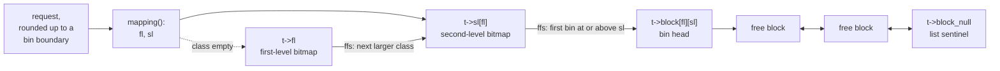

# tlsf-bsd: Two-Level Segregated Fit Memory Allocator

An O(1) constant-time memory allocator for real-time and embedded systems,
derived from the BSD-licensed implementation by
[Matthew Conte](https://github.com/mattconte/tlsf) and based on the
[TLSF specification](http://www.gii.upv.es/tlsf/main/docs.html).

Allocation and deallocation are O(1) regardless of allocation pattern or heap
state, with low fragmentation: a bound required by hard real-time systems, where
unbounded latency is unacceptable. Only the `realloc` paths that move payload
bytes cost more, and they cost exactly the copy.

This implementation was written from the published specification rather than
derived from the GPL-licensed reference implementation that accompanies the
paper, so no GPL restrictions apply.

## Features

* O(1) cost for `malloc`, `free`, `aligned_alloc`, and for `realloc` when it
  grows forward or shrinks in place; the backward and relocating `realloc`
  paths add one payload copy
* One word overhead per allocation
* 32 second-level subdivisions per first-level class
  (~3.125% max internal fragmentation for large allocations)
* Immediate coalescing on free (no deferred work)
* Two pool modes: dynamic (auto-growing via `tlsf_resize`) and static
  (fixed-size via `tlsf_pool_init`)
* Pool extension via `tlsf_append_pool` (coalesces adjacent memory)
* Realloc with in-place expansion, forward into a free successor, or backward
  into a free predecessor while absorbing a free successor in the same step
* Branch-free size-to-bin mapping
* Optional thread-safe wrapper (`tlsf_thread.h`)
  with per-arena fine-grained locking; pthreads, C11 threads and Win32 backends,
  and configurable lock primitives for RTOS portability
* Public headers compile as both C and C++
* ACSL contracts on the core helpers, checked by Frama-C WP (`make verify`)
* Minimal libc as shipped: only `stddef.h`, `stdbool.h`, `stdint.h`,
  `string.h`. Debug builds add `assert.h`, and `TLSF_ENABLE_CHECK` adds
  `stdio.h` and `stdlib.h` for the abort path

## Documentation

This file is the tour. The three pages under `docs/` are the reference.

| Page | Covers |
|------|--------|
| [Design](docs/design.md) | Two-level segregated fit, the bitmaps, size-to-bin mapping, block and pool layout |
| [Operations](docs/operations.md) | malloc, free, realloc, aligned alloc, pool modes, complexity, the threading wrapper |
| [Configuration and Verification](docs/configuration-and-verification.md) | Compile flags, derived constants, the ABI guard, heap checks, tests, fuzzing, Frama-C, WCET |

## Build and Test

```shell
make all          # Build test, bench, wcet, fuzz, test_thread, test_cpp
make check        # Run the full suite with heap debugging
make bench        # Full throughput benchmark (50 iterations)
make bench-quick  # Quick benchmark for development
make wcet         # WCET measurement (10000 iterations)
make wcet-quick   # Quick WCET check
make wcet-plot    # WCET with raw samples plus plots (needs python3)
make verify       # Frama-C WP proof run over the annotated helpers
make fuzz         # libFuzzer campaign over the allocator (needs clang)
make clean        # Remove build artifacts
```

Compile flags used by default:
```
-std=gnu11 -g -O2 -Wall -Wextra -Wshadow -Wpointer-arith -Wcast-qual
-Wconversion -Wc++-compat -DTLSF_ENABLE_ASSERT -DTLSF_ENABLE_CHECK
```

The two `-D` flags come from `TLSF_DEBUG_FLAGS`. Clear it to build and test the
library the way it ships, which is the only way the off-branches of
`TLSF_ENABLE_ASSERT` and `TLSF_ENABLE_CHECK` get compiled:

```shell
make check TLSF_DEBUG_FLAGS=
```

### Compile-time configuration

| Flag | Effect |
|------|--------|
| `TLSF_ENABLE_ASSERT` | Enable runtime assertions in allocator internals |
| `TLSF_ENABLE_CHECK` | Enable `tlsf_check()` heap consistency validation |
| `TLSF_MAX_POOL_BITS` | Lower the first-level exponent ceiling, shrinking `tlsf_t`: 8,376 bytes by default, 2,920 at `=18` |
| `TLSF_SPLIT_THRESHOLD` | Minimum remainder worth splitting off when trimming. Default `BLOCK_SIZE_MIN`, 24 on 64-bit |

`TLSF_ENABLE_POISON`, `TLSF_NO_INTRINSICS` and the thread wrapper's knobs are in
[Configuration](docs/configuration-and-verification.md#configuration), along
with what each one costs and which of them move a structure layout.

Pass all of them through `CPPFLAGS`, never `CFLAGS` or `CXXFLAGS`; the Makefile
rejects the latter, because a macro that reaches only one compiler leaves the C
and C++ objects disagreeing about `sizeof(tlsf_t)`.

### Formal verification

`make verify` proves the annotated leaf helpers consistent with their own
contracts. It is not a proof of the allocator: the public entry points other
than `tlsf_pool_reset` are unproved, and several listed helpers carry no
postcondition, so "proved" there means "cannot fault", not "returns the right
answer". The `WP_FUNCTIONS` list in the Makefile states the exact scope.

## API

### Core Allocation

```c
#include "tlsf.h"

/* Dynamic pool (auto-growing): user must define tlsf_resize() */
tlsf_t t = TLSF_INIT;
void *p = tlsf_malloc(&t, 256);
void *q = tlsf_aalloc(&t, 64, 256);   /* 64-byte aligned */
p = tlsf_realloc(&t, p, 512);
tlsf_free(&t, p);
tlsf_free(&t, q);

/* Static pool (fixed-size): no tlsf_resize() needed */
char pool[1 << 20];
tlsf_t s;
size_t usable = tlsf_pool_init(&s, pool, sizeof(pool));
void *r = tlsf_malloc(&s, 100);
tlsf_free(&s, r);
```

### Functions

| Function | Description |
|----------|-------------|
| `tlsf_malloc(t, size)` | Allocate `size` bytes. Zero `size` returns a unique minimum-sized block. |
| `tlsf_free(t, ptr)` | Free a previously allocated block. NULL is a no-op. |
| `tlsf_realloc(t, ptr, size)` | Resize allocation. Tries in-place expansion before relocating. |
| `tlsf_aalloc(t, align, size)` | Allocate with alignment. `align` must be a power of two. |
| `tlsf_pool_init(t, mem, bytes)` | Initialize a fixed-size pool. Returns usable bytes, 0 on failure. |
| `tlsf_append_pool(t, mem, size)` | Extend pool with adjacent memory. Returns bytes used, 0 on failure. |
| `tlsf_resize(t, size)` | Platform callback for dynamic pool growth (weak symbol). |
| `tlsf_usable_size(ptr)` | Return the usable size of an allocated block. |
| `tlsf_check(t)` | Validate heap consistency (requires `TLSF_ENABLE_CHECK`). |
| `tlsf_get_stats(t, stats)` | Collect heap statistics (free/used bytes, block counts, overhead). |
| `tlsf_pool_reset(t)` | Reset a static pool to its initial empty state (bounded time). |

### Thread-Safe Wrapper

For concurrent use, include the optional per-arena wrapper:

```c
#include "tlsf_thread.h"

static char pool[4 * 1024 * 1024];
tlsf_thread_t ts;

size_t usable = tlsf_thread_init(&ts, pool, sizeof(pool));
void *p = tlsf_thread_malloc(&ts, 256);
void *q = tlsf_thread_aalloc(&ts, 64, 256);
p = tlsf_thread_realloc(&ts, p, 512);
tlsf_thread_free(&ts, p);
tlsf_thread_free(&ts, q);
tlsf_thread_destroy(&ts);
```

| Function | Description |
|----------|-------------|
| `tlsf_thread_init(ts, mem, bytes)` | Split memory into per-arena sub-pools. Returns total usable bytes. |
| `tlsf_thread_destroy(ts)` | Release lock resources. Does not free the memory region. |
| `tlsf_thread_malloc(ts, size)` | Thread-safe malloc with per-arena locking. |
| `tlsf_thread_aalloc(ts, align, size)` | Thread-safe aligned allocation. |
| `tlsf_thread_realloc(ts, ptr, size)` | Thread-safe realloc. In-place first, cross-arena fallback. |
| `tlsf_thread_free(ts, ptr)` | Thread-safe free. Finds owning arena automatically. |
| `tlsf_thread_check(ts)` | Heap consistency check across all arenas. |
| `tlsf_thread_stats(ts, stats)` | Aggregate statistics across all arenas. |
| `tlsf_thread_reset(ts)` | Reset all arenas to initial state (bounded time). |

`TLSF_ARENA_COUNT` is the arena count, four by default, and a ceiling rather
than a promise: `tlsf_thread_init()` halves it while the per-arena share would
fall below 256 bytes. The lock backend is chosen by the header: C11 `mtx_t`
when `TLSF_C11_THREADS` asks for it and `<threads.h>` is available, Win32
`SRWLOCK` or `CRITICAL_SECTION` on Windows otherwise, `pthread_mutex_t`
everywhere else; see [Lock backends](docs/operations.md#lock-backends) for the
migration note. For a platform-specific lock (FreeRTOS semaphore, Zephyr
k_mutex, bare-metal spinlock), define `TLSF_LOCK_T` and the five lock macros
before including `tlsf_thread.h`; that bypasses the selection, so matching the
backend across translation units becomes the caller's obligation.

The full knob list is in
[Thread wrapper flags](docs/configuration-and-verification.md#thread-wrapper-flags),
and the design is in [Concurrency](docs/operations.md#concurrency).

### C++ std::pmr adapters

`include/tlsf_pmr.hpp` is an optional, header-only C++17 wrapper for consumers
that accept a `std::pmr::memory_resource`, such as ROS 2 nodes. Including it
requires C++17; the library and its public headers stay C11 and C++11.

```cpp
#include <vector>

#include "tlsf_pmr.hpp"

alignas(64) static unsigned char memory[64 * 1024];

tlsf_t pool = TLSF_INIT;
if (!tlsf_pool_init(&pool, memory, sizeof(memory)))
    return -1;

tlsf::pmr_resource res(pool);
std::pmr::vector<int> v(&res);
v.push_back(1);
```

`tlsf::pmr_thread_resource`, in the separate `include/tlsf_thread_pmr.hpp`,
is the same wrapper over `tlsf_thread_t`, so a concurrent PMR user gets the
per-arena locks instead of one global mutex. It is a separate header because
`tlsf_thread.h` pulls in the platform's threading header and needs a lock
backend, which a single-threaded consumer of `pmr_resource` should not have to
supply:

```cpp
#include "tlsf_thread_pmr.hpp"

alignas(TLSF_CACHELINE_SIZE) static unsigned char thread_memory[256 * 1024];

tlsf_thread_t ts;
if (!tlsf_thread_init(&ts, thread_memory, sizeof(thread_memory)))
    return -1;

tlsf::pmr_thread_resource res(ts);
```

Both are non-owning views: the pool and the resource must outlive every
allocation, since a `std::pmr` container calls back into the resource when it
is destroyed. Every allocation routes through `tlsf_aalloc()`, so a container
of over-aligned elements gets the alignment it asked for. Exhaustion throws
`std::bad_alloc`; with exceptions disabled it calls `std::terminate()` instead,
since `memory_resource` may not return a null allocation. That kills the
process, and `std::set_terminate()` is the only hook, so a caller for which
exhaustion is a recoverable condition should use `tlsf_aalloc()` directly
rather than reach the allocator through PMR. Neither adds locking of its own.
`pmr_resource` is unsynchronized exactly like the C allocator, and
`pmr_thread_resource` inherits the contracts in `tlsf_thread.h`.

Be precise about what the O(1) claim covers, because reaching TLSF through PMR
does not widen it. Bounded is the allocator's own work on one call: finding a
fit is two bitmap scans, and splitting and coalescing are constant-time. Four
costs sit outside that bound, and PMR changes none of them.

| Cost | Why it is still there |
|------|----------------------|
| Container growth | A `std::pmr::vector` that outgrows its capacity allocates once and then moves every element it already held, so `push_back()` is O(n) in the worst case however fast the allocation was. |
| External fragmentation | The size classes bound *internal* fragmentation to about 3.125%. Whether a request finds a large enough free block still depends on the order the caller allocated and freed; when none exists, `do_allocate()` throws `std::bad_alloc`, or terminates where exceptions are disabled. |
| Virtual dispatch | Every allocation through a `memory_resource` is an indirect call that a direct `tlsf_malloc()` is not. |
| Lock waits | For `pmr_thread_resource` only. Per-arena locking makes contention less likely; it does not bound how long a thread waits once contended. |

A latency budget has to account for all four on top of the allocator's own
bound.

## How It Works

TLSF keeps free blocks pre-sorted into size classes, and keeps one bit per class
to say whether that class is occupied. Finding a fit is then two bitmap scans and
an array dereference, not a search: the bin lookup is the allocation.
[Design](docs/design.md) has the full account.

### Two-level segregated fit

* First level (FL): a power-of-two class. Class `i > 0` covers
  `[2^(i+7), 2^(i+8))` on 64-bit, so 32 classes span every allocatable size.
* Second level (SL): each class subdivided into 32 equal linear bins, which
  bounds the round-up waste at `1/32 = 3.125%`.
* Below 256 bytes that subdivision would be finer than the 8-byte alignment, so
  class 0 is binned linearly instead: one bin per aligned size, and no internal
  fragmentation at all.

A set bit in `t->fl` means the class holds a free block; a set bit in `t->sl[i]`
means that bin does. One `ffs` on the second-level bitmap finds the first bin at
or above the request. If the class is empty, one more `ffs` on the first-level
bitmap finds the next larger class. Each `ffs` is one or two hardware
instructions, `tzcnt` or `bsf` on x86 and `rbit` plus `clz` on ARM, so the
lookup is worst-case constant time, not amortized and not expected-case.



[The full structure](docs/design.md#the-full-structure) draws the same thing
with a worked set of bits, bin ranges and block sizes.

### Block layout

One word of overhead per allocation, and no footer. A block's other fields
overlap its neighbours' payloads: the free-list links live in the payload while
the block is free, and the successor's `prev` pointer is the last word of this
block's payload, which is the boundary tag.

Block sizes are multiples of `ALIGN_SIZE`, so the low bits of the size word are
always zero and hold two flags instead: `F` for "this block is free" and `P` for
"the previous block is free". `P` plus the `prev` boundary tag are what make
backward coalescing O(1).

Each pool ends in a zero-size sentinel block. It terminates the chain, is never
free, and never enters a bin.
[Blocks in memory](docs/design.md#blocks-in-memory) draws the layout byte by
byte and
explains why the minimum block is 24 bytes.

### Operations

| Operation | Summary |
|-----------|---------|
| Allocate | Round the request up to a bin boundary, take the head of the first non-empty bin at or above it, split off the tail if the remainder is worth keeping. Sizes under 256 bytes skip the mapping arithmetic when class 0 already holds a block at or above the request. |
| Free | Set the free bit, merge with a free predecessor and a free successor, insert the result. Coalescing is immediate: no deferred pass, no compaction, no latency spikes from batch reclamation. |
| Realloc | Grow forward into a free successor with no copy, else backward into a free predecessor with a `memmove` that also absorbs a free successor, else allocate, copy and free. Shrinking trims in place. |
| Aligned alloc | Over-allocate, split the front gap back onto a free list, trim the tail. |

Worst cases stay O(1): the most expensive allocation is a full bitmap fallback
plus a split, and the most expensive free is a block sandwiched between two free
neighbours. [Operations](docs/operations.md) walks each path.

### Pool modes

Dynamic pools grow on demand through a user-supplied `tlsf_resize()` callback
and shrink when the tail block becomes free. Fixed pools (`tlsf_pool_init`) use
a caller-owned region and never call `tlsf_resize()`. Either can be extended
with `tlsf_append_pool()` when adjacent memory is available.

`tlsf_resize()` is a weak symbol defaulting to NULL, so fixed-pool users need
not define it and dynamic-pool users must. Its full contract, and what happens
when it is missing, is in [Pool modes](docs/operations.md#pool-modes). Multiple
independent allocators are just multiple `tlsf_t` instances with their own
memory.

### Thread safety

The core allocator is single-threaded by design: no lock, no atomic, no barrier.
The optional wrapper in `tlsf_thread.h` splits the pool into `TLSF_ARENA_COUNT`
independent sub-pools, each with its own lock and its own cache line, and maps
threads to arenas by a hash of the thread identifier. Allocation tries the
preferred arena, then the others by non-blocking `trylock`, then blocking.
Free finds the owning arena by pointer range and locks only that one.

[Concurrency](docs/operations.md#concurrency) covers the arena-count
trade-offs, the fallback path when an arena is full, and how to port the lock
backend to an RTOS.

### Constants

| Constant | 64-bit | 32-bit | Notes |
|----------|--------|--------|-------|
| `TLSF_MAX_SIZE` | 256 GiB - 8 | 1 GiB - 4 | Largest single allocation; reduced by `TLSF_MAX_POOL_BITS` |
| `TLSF_MAX_POOL_BYTES` | 256 GiB + 16 | 1 GiB + 8 | Largest region `tlsf_pool_init()` accepts |
| FL classes | 32 | 25 | `_TLSF_FL_MAX - _TLSF_FL_SHIFT + 1` |
| Alignment | 8 bytes | 4 bytes | |
| Min block | 24 bytes | 12 bytes | `sizeof(tlsf_block) - sizeof(ptr)` |
| Block overhead | 8 bytes | 4 bytes | One word, no footer |
| SL subdivisions | 32 | 32 | |

`tlsf_t` is caller-allocated and holds the whole `FL x SL` bin array, so its
size is set entirely by the configuration: 8,376 bytes by default on 64-bit,
down to 2,920 with `-DTLSF_MAX_POOL_BITS=18`. A `tlsf_thread_t` is roughly
`TLSF_ARENA_COUNT` times that.

The layout knobs change that structure, and callers allocate it, so every
translation unit in a build must see the same set. A mismatch is a link error
rather than silent corruption: those knobs are folded into the public symbol
names, so disagreeing objects fail to resolve. Flags that do not move a layout
are not encoded and not diagnosed. See
[Configuration](docs/configuration-and-verification.md#configuration) for the
size tables, the guard, and what it asks of callers.

## WCET Measurement

The `tests/wcet.c` tool measures per-operation latency under pathological
scenarios, to bound the constant hiding behind the O(1):

```shell
make wcet          # 10000 iterations across four scenarios
make wcet-plot     # the same, plus raw samples and plots under build/
```

Four scenarios run: allocation from a single huge free block, an exact bin hit,
a free sandwiched between two free neighbours, and a free with no merge. The
tool reports the whole distribution rather than one number, because on a
general-purpose OS the tail is scheduler preemption and not the allocator.

[WCET measurement](docs/configuration-and-verification.md#wcet-measurement)
lists the timing sources, the raw-sample options, and a sample run.

## Reference

M. Masmano, I. Ripoll, A. Crespo, and J. Real.
TLSF: a new dynamic memory allocator for real-time systems.
In Proc. ECRTS (2004), IEEE Computer Society, pp. 79-86.

## Licensing

TLSF-BSD is freely redistributable under the 3-clause BSD License.
Use of this source code is governed by a BSD-style license that can be found
in the [LICENSE](LICENSE) file.
