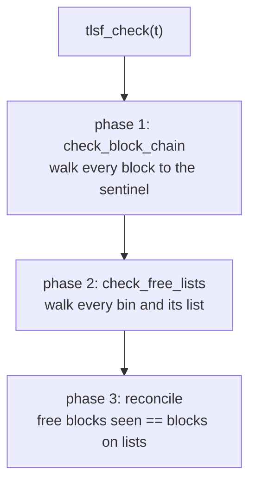

# Configuration and Verification

[Configuration](#configuration) is the build-time knobs and the constants they
derive. [Verification](#verification) is the five independent ways this tree
checks that whatever you configured behaves.

## Configuration

Every knob here is a preprocessor macro. Three of them, `TLSF_MAX_POOL_BITS`,
`TLSF_ARENA_COUNT` and `TLSF_CACHELINE_SIZE`, change the layout of a structure
the caller allocates, and the lock backend selection does too. The rest do not,
but the build treats them alike, which makes one rule non-negotiable: pass them
through `CPPFLAGS`, so every translation unit in the build sees the same set.

```shell
make check CPPFLAGS="-DTLSF_MAX_POOL_BITS=20"
```

The Makefile rejects TLSF macros in `CFLAGS` or `CXXFLAGS` with an error,
because those reach only one language's compiler and the C and C++ objects would
then disagree about `sizeof(tlsf_t)`.

### Core flags

| Flag | Default | Effect |
|------|---------|--------|
| `TLSF_ENABLE_ASSERT` | off | Runtime assertions in allocator internals, via `assert()` |
| `TLSF_ENABLE_CHECK` | off | Compiles `tlsf_check()`; without it the function is an empty stub |
| `TLSF_ENABLE_POISON` | off | Fills payloads with `0xAA` on allocation and `0xFF` on free |
| `TLSF_NO_INTRINSICS` | off | Forces the portable bit-scan fallbacks |
| `TLSF_MAX_POOL_BITS` | 39 (64-bit), 31 (32-bit) | Lowers the first-level exponent ceiling, which shrinks `FL_COUNT` and with it `tlsf_t` |
| `TLSF_SPLIT_THRESHOLD` | `BLOCK_SIZE_MIN` | Minimum remainder worth splitting off |
| `INLINE` | `always_inline` | Override to `static inline` to let the compiler decide; measured 168 bytes smaller in `.text` at -O2 on clang/arm64, with no latency change |

The Makefile turns the first two on through `TLSF_DEBUG_FLAGS`. Clearing that
variable is the only way to compile the off-branches:

```shell
make check TLSF_DEBUG_FLAGS=
```

`TLSF_ENABLE_POISON` is for targets without sanitizers. Where ASan is available
the allocator already teaches it the pool layout through
`__asan_poison_memory_region()`, with no flag needed and no cost when ASan is
absent. Both skip the words a free block uses for its list pointers and the
successor's boundary tag.

`TLSF_SPLIT_THRESHOLD` trades internal fragmentation for fewer unusable
fragments. Raising it means a block whose leftover is small is handed out whole
rather than split into something too small to satisfy anything. It is bounded at
both ends by static assertions: at least `BLOCK_SIZE_MIN`, so a split remainder
is always a legal block, and at most `BLOCK_SIZE_MAX`, so the arithmetic in
`block_can_trim()` cannot wrap.

### Thread wrapper flags

| Flag | Default | Effect |
|------|---------|--------|
| `TLSF_ARENA_COUNT` | 4 | Independent sub-pools, each with its own lock |
| `TLSF_CACHELINE_SIZE` | 64 | Per-arena padding, must be a power of two |
| `TLSF_C11_THREADS` | off | The C11 `<threads.h>` backend, where available |
| `TLSF_LOCK_T` plus five macros | platform default | A caller-supplied lock backend |
| `TLSF_THREAD_HINT()` | platform thread id | Hash input for arena selection |

`TLSF_ARENA_COUNT` needs no particular value: selection takes a modulo of the
live arena count, so a power of two buys nothing. See
[Concurrency](operations.md#concurrency) for what the count costs and buys, and
for the backend selection order.

### Derived constants

| Constant | 64-bit | 32-bit | Source |
|----------|--------|--------|--------|
| `ALIGN_SIZE` | 8 | 4 | `1 << ALIGN_SHIFT` |
| `SL_COUNT` | 32 | 32 | `1 << SL_SHIFT` |
| `FL_SHIFT` | 8 | 7 | `SL_SHIFT + ALIGN_SHIFT` |
| `FL_MAX` | 39 | 31 | `TLSF_MAX_POOL_BITS` if defined; an exponent, not an index |
| `FL_COUNT` | 32 | 25 | `FL_MAX - FL_SHIFT + 1` |
| `BLOCK_OVERHEAD` | 8 | 4 | `sizeof(size_t)` |
| `BLOCK_SIZE_MIN` | 24 | 12 | `sizeof(tlsf_block) - sizeof(void *)` |
| `BLOCK_SIZE_SMALL` | 256 | 128 | `1 << FL_SHIFT`, the linear/log boundary |
| `BLOCK_SIZE_MAX` | 2^38 | 2^30 | `1 << (FL_MAX - 1)` |
| `TLSF_MAX_SIZE` | 2^38 - 8 | 2^30 - 4 | Largest single allocation |
| `TLSF_MAX_POOL_BYTES` | 2^38 + 16 | 2^30 + 8 | Largest region `tlsf_pool_init()` accepts |

Note the factor of two between `TLSF_MAX_POOL_BITS` and the pool a fixed-size
initializer will accept. The ceiling bounds a dynamic arena at
`2^TLSF_MAX_POOL_BITS`, but a fixed pool starts life as one free block, and a
block is capped at `2^(FL_MAX - 1)`. At `TLSF_MAX_POOL_BITS=20` the largest
region `tlsf_pool_init()` takes is 524304 bytes, not 1 MB.

### Control structure size

`tlsf_t` is dominated by the `FL_COUNT x SL_COUNT` array of bin heads, so
lowering the first-level exponent ceiling is how it shrinks:

| Configuration | 64-bit `tlsf_t` | Bins | Largest fixed pool |
|---------------|-----------------|------|--------------------|
| default, `FL_MAX` 39 | 8,376 B | 1024 | 2^38 + 16 |
| `-DTLSF_MAX_POOL_BITS=24` | 4,480 B | 544 | 8,388,624 B |
| `-DTLSF_MAX_POOL_BITS=20` | 3,440 B | 416 | 524,304 B |
| `-DTLSF_MAX_POOL_BITS=18` | 2,920 B | 352 | 131,088 B |

Values below 18 still compile and work; 18 is where the bundled test suite's
pool sizes bottom out. The floor the code itself enforces is
`_TLSF_FL_COUNT >= 1`.

`tlsf_thread_t` is roughly `TLSF_ARENA_COUNT` times that, rounded up per arena:

```
arena = round_up(sizeof(tlsf_t) + sizeof(TLSF_LOCK_T) + sizeof(void *) +
                 sizeof(size_t),
                 TLSF_CACHELINE_SIZE)
total = round_up(arena * TLSF_ARENA_COUNT + sizeof(int), TLSF_CACHELINE_SIZE)
```

With the default configuration and four arenas that is 34,112 bytes where
`pthread_mutex_t` is 64 bytes (macOS) and 33,856 where it is 40 (glibc x86-64).
Print `sizeof(tlsf_thread_t)` on the target rather than trusting either number.

### Configuration mismatch guard

`tlsf_t` and `tlsf_thread_t` are caller-allocated, and their layout moves with
the macros above. A translation unit built with different values allocates the
wrong size, and the first call writes past the end of the caller's object.

That used to link cleanly and corrupt memory later, somewhere else. It no longer
does: the layout knobs are folded into the public symbol names, so a
disagreement is an undefined reference that names the values each side used.

```
$ cc -DTLSF_MAX_POOL_BITS=20 -c caller.c    # library built without the flag
$ cc -o app caller.o tlsf.o
Undefined symbols for architecture arm64:
  "_tlsf_pool_init_w64_fl20", referenced from:
      _main in caller.o
```

`w64` is `_TLSF_SIZE_WIDTH`, `fl20` is `_TLSF_FL_MAX`. The thread wrapper adds
its own tags for `TLSF_ARENA_COUNT`, `TLSF_CACHELINE_SIZE` and which lock
backend the header selected.

That last tag names the backend rather than recording C11-or-not, so it covers
`SRWLOCK` versus `CRITICAL_SECTION` too, the pair no build flag chooses between.
A caller-supplied `TLSF_LOCK_T` stays outside it: the header makes no selection
to record, while the lock type still moves the fields stored behind it in each
arena, so that one remains a caller obligation. Do not reach for `sizeof` in its
place. The cache-line padding hides a lock-size change from the arena stride
until it crosses a whole line, so two incompatible builds usually measure the
same.

Four consequences worth knowing:

* The knobs must be bare decimal literals. `-DTLSF_MAX_POOL_BITS=(10+10)` does
  not paste into a valid identifier and fails to compile. That covers
  `TLSF_MAX_POOL_BITS`, `TLSF_ARENA_COUNT` and `TLSF_CACHELINE_SIZE`.
* Source is unchanged: callers still write `tlsf_malloc()`. Only the emitted
  symbol carries the suffix. Anything that resolves by name at runtime, `dlsym`
  or an FFI binding, needs the suffixed spelling.
* A caller-supplied `TLSF_LOCK_T` cannot be encoded in a token, so a
  disagreement about the lock type stays undetected. Define it in one header
  every translation unit includes.
* Only the encoded knobs are guarded. Flags that do not move a layout, among
  them `TLSF_ENABLE_ASSERT`, `TLSF_ENABLE_CHECK` and `TLSF_ENABLE_POISON`, may
  differ between objects without a diagnostic. That is harmless for the layout,
  though a consumer compiled without `TLSF_ENABLE_CHECK` silently gets the
  inline no-op `tlsf_check()` even when the library has the real one.

Frama-C is exempted from the renaming, since it analyses one translation unit at
a time and the suffixes would invalidate the `-wp-fct` list in the Makefile.

`.ci/check-abi-guard.sh` tests both directions: a mismatched pair must fail to
link, and a matched pair must still build and run. The second half matters as
much as the first, because a guard that rejects legitimate builds is worse than
no guard.

## Verification

An allocator that is subtly wrong corrupts memory somewhere else, later, in code
that did nothing wrong. The five checks below are independent, and none of them
subsumes the others. Three run in seconds; fuzzing and the Frama-C pass are the
two that want their own CI job and a budget.

### Heap consistency checking

`tlsf_check(t)` walks the whole allocator and aborts on the first broken
invariant. It compiles to nothing without `TLSF_ENABLE_CHECK`, so calling it
from production code costs nothing when the flag is off.

Three phases:



Phase 1 walks the physical chain from the arena base and checks, per block, that
the size is aligned and within the mapping range, that the block and its payload
are aligned, that the `P` bit agrees with the predecessor's actual state, that
the `prev` boundary tag points where it should, and that no two adjacent blocks
are free. It finishes by checking the sentinel's flags and that the block sizes
plus per-block overhead sum exactly to `t->size`.

Phase 2 walks the bitmaps and the lists together. A clear first-level bit
requires an all-zero second-level bitmap and every head in that class pointing
at the free-list sentinel. A set first-level bit requires a non-zero second-level
bitmap, and then within that class each head must be a real block exactly when
its own second-level bit is set. Within each non-empty list, every block must be
free, must map back to the bin holding it, must have both physical neighbours in
use, and must have consistent forward and backward links.

The sweep is unconditional: every one of the `FL_COUNT * SL_COUNT` bins is
visited whether or not its bitmap bit is set, which is what makes the check cost
a fixed 1024-bin floor on top of the walk.

Floyd's cycle detection runs alongside the list walk, so a block linked into a
list twice, the usual shape of a double free, is caught within O(n) steps and
with O(1) extra memory. That replaced a 16 KB hash table, which is the kind of
overhead an embedded target cannot spare in a debug build either.

Phase 3 is one comparison: the number of free blocks the chain walk saw must
equal the number the list walk saw. A block that is free but missing from every
bin, or on a bin but not free, fails here even if it passed both walks.

Cross-bin duplicates need no separate pass. Every block is checked to map to the
bin holding it, so one block cannot sit in two bins without failing phase 2.

### Test suite

```shell
make check                      # the full suite
make check TLSF_DEBUG_FLAGS=    # the same, compiled the way the library ships
```

`make check` runs the core test and the three benchmark configurations under
`MALLOC_CHECK_=3`, then the WCET harness, the thread stress test and the C++
compile test.

`tests/test.c` is the core suite: randomized allocate/free/realloc storms
against a pool, with `tlsf_check()` run periodically rather than after every
operation, since checking is O(blocks) and doing it every time turns the test
quadratic. Alongside those are targeted tests for the cases randomization is
unlikely to reach, among them large allocations at the size ceiling, pool append
and adjacency rejection, backward realloc, fragmentation behaviour, zero-size and
alignment edges, pool reset, the small-bin trim path, argument contracts on every
public function, and address reuse.

`tests/test_thread.c` stresses the thread wrapper: concurrent malloc, free,
realloc and aligned allocation across threads, with `tlsf_thread_check()`
verifying every arena afterwards. `tests/test_cpp.cpp` compiles the public
headers as C++ and exercises the API, which is what keeps them free of C-only
constructs. `tests/fuzz.c` is covered below.

How much of the allocator all of that reaches is measured rather than assumed:

```shell
bash .ci/check-coverage.sh          # fails below the floor, prints what is missed
```

The script runs the three correctness binaries, `test`, `test_thread` and
`fuzz`, which all link the same `build/tlsf.o`; gcov accumulates across runs, so
the figure is their union. `bench` and `wcet` are left out, since they exercise
paths those three already cover and cost minutes.

Assertions are compiled out for the measurement, heap checking left on. With
`TLSF_ENABLE_ASSERT` the `ASSERT()` lines carry the call that fires when an
assertion fails, a block a passing run must never enter, so the figure would
punish the suite for not failing. gcc and clang also disagree about which line
to charge them to, which is how a floor calibrated on one toolchain came to
fail on the other.

The floor is a ratchet at 99% of the lines in `src/tlsf.c`. What stays
unreached is the configured-ceiling rejections, in `arena_grow()`, in the
append path and in `tlsf_pool_init()`, which only a reduced
`TLSF_MAX_POOL_BITS` can reach and the configuration jobs do cover, plus the
guard in `tlsf_get_stats()` against an allocator that claims bytes with no
arena, which no legal call sequence produces. How many lines gcov charges those
to depends on the toolchain, one on gcc and four on clang, so the script prints
them rather than asserting a count.

CI runs the whole thing across a matrix that is worth knowing about, because it
is what the flags above are for:

| Axis | Coverage |
|------|----------|
| Compilers | GCC and Clang, x86-64 and ARM64 |
| Sanitizers | ASan, UBSan, TSan; ASan combined with `TLSF_ENABLE_POISON` |
| Configuration | `TLSF_MAX_POOL_BITS=20` and `=24`, `TLSF_SPLIT_THRESHOLD=64` |
| Release shape | `-DNDEBUG` with `TLSF_DEBUG_FLAGS=` cleared |
| Portability | 32-bit multilib, MSVC on Windows, `TLSF_NO_INTRINSICS` |
| Guards | ABI mismatch script, clang-format, trailing newlines, cppcheck |
| Measurement | line-coverage floor on `src/tlsf.c`, libFuzzer smoke run |

ThreadSanitizer is the only sanitizer that sees races in the per-arena locking;
ASan does not, which is why TSan has its own matrix entries on both
architectures.

The release entry matters more than it looks: it is the only build-and-test job
that compiles the empty `ASSERT()`, the `tlsf_check()` stub, and the machinery
that keeps them warning-free. That is the build users actually ship. The WCET
job builds the same way, on both architectures, but only measures.

### Fuzzing

```shell
make fuzz                    # libFuzzer, needs clang
make fuzz FUZZ_RUNS=1000000  # longer campaign
```

`tests/fuzz.c` replays an input buffer as a stream of allocator operations:
malloc, free, realloc, aligned allocation, and a mid-stream `tlsf_check()`. The
randomized tests draw from `rand()` and so explore one shape of history per
seed; a coverage-guided fuzzer steers the operation stream toward branches
nothing has taken, which is what reaches the split, merge and trim corners that
only appear after a specific sequence of sizes.

Two oracles run. `tlsf_check()` is the structural one. The second is a per-slot
payload tag, written on every allocation and verified before every release,
which catches two live blocks overlapping. No heap invariant can see that
failure, because the metadata stays perfectly consistent while the payloads
collide.

The same file carries a deterministic driver, so a toolchain without libFuzzer
still exercises the target through `make check`. A failure there reproduces from
the fixed seed alone.

### Formal verification

```shell
make verify        # needs Frama-C and Alt-Ergo
```

The leaf helpers in `src/tlsf.c` carry ACSL contracts, and `make verify` runs
Frama-C's WP plugin with runtime-error generation over the list in
`WP_FUNCTIONS`. The target fails if any goal is unproved.

Read the result for what it is. The list is a subset of the functions in the
file, and `tlsf_pool_reset` is the only public entry point on it: `tlsf_malloc`,
`tlsf_free`, `tlsf_realloc`, `tlsf_aalloc`, `tlsf_pool_init`,
`tlsf_append_pool`, `tlsf_usable_size`, `tlsf_check` and `tlsf_get_stats` are
all unproved, as are the arena helpers they call. Because no caller of the
proved helpers is in the list, every `requires` is an assumed hypothesis rather
than a discharged one.

Several proved helpers also have no postcondition, which means "proved" is
"cannot fault", not "returns the right answer". Injecting a real bug into
`align_offset()` still yields a fully proved run; the same injection into
`block_set_prev_free()`, which does carry `ensures` clauses, is caught. A green
run is a floor, not a certificate.

Two classes of WP warning are expected and cannot be annotated away: skipped RTE
guards for `\aligned` and `\valid_function`, which the Typed model does not
support, and incompatible-pointer-cast warnings for the `char *` block
arithmetic. The Bytes model handles those casts natively but is experimental and
leaves two goals unproved, so `Typed+nocast` stays.

### WCET measurement

The O(1) claim is about the shape of the code: no path contains a loop whose
trip count depends on the heap. `tests/wcet.c` measures the constant that shape
hides, under scenarios chosen to be pathological rather than typical.

| Scenario | What it forces |
|----------|----------------|
| `malloc_worst` | small allocation served from one huge free block: full bitmap fallback, split, remainder insert |
| `malloc_best` | exact bin hit, no split |
| `free_worst` | block sandwiched between two free neighbours: two merges, two unlinks, one insert |
| `free_best` | both neighbours in use, no merge |

```shell
build/wcet -i 10000 -w 1000          # standard measurement
build/wcet -i 10000 -C               # cold cache
build/wcet -i 10000 -c               # CSV summary
build/wcet -i 10000 -r samples.csv   # raw samples, for make wcet-plot
```

Timing comes from `rdtsc` on x86-64, `cntvct_el0` on ARM64,
`mach_absolute_time()` on macOS, `QueryPerformanceCounter` on Windows, and
`clock_gettime(CLOCK_MONOTONIC)` as the portable fallback. The tool reports min,
p50, p90, p99, p99.9, max, mean and standard deviation.

A run on an Apple M1, assertions and heap checking compiled in, 2000 iterations:

```
--- malloc_worst (small alloc from single huge block) ---
    size        min        p50        p90        p99      p99.9        max
      16         41         42         84        209      31708      43708
     256          0         42         83         84        250        250
    4096         41         42         84        167       1125       3958
```

The median is 42 ns regardless of request size, which is the property being
tested: cost does not track the size of the request or the state of the heap.
The tail is not the allocator. Values in the tens of microseconds are scheduler
preemption and cache misses on a general-purpose OS; a real WCET number needs a
target with interrupts and preemption under control, which is why the tool
reports the whole distribution rather than a single figure.

Read the percentiles, not the max, unless the run was on isolated hardware.
