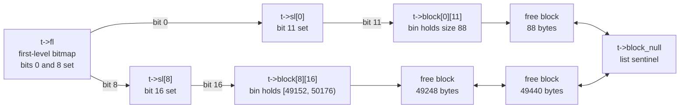

# Design

TLSF answers one question in constant time: given a request of `n` bytes, where
is a free block at least that large? It answers without searching, by keeping
free blocks pre-sorted into size classes and keeping one bit per class to say
whether that class is occupied.

This page covers the data structure in two parts: [the index](#the-index), which
turns a size into a bin, and [blocks in memory](#blocks-in-memory), which is what
the bins point at. [Operations](operations.md) covers what the entry points do
with both, and [Configuration and
Verification](configuration-and-verification.md) covers the knobs that resize
them.

Numbers throughout are for a 64-bit build with the default configuration:
8-byte alignment, 32 first-level classes, 32 second-level bins per class. The
32-bit figures are in
[Derived constants](configuration-and-verification.md#derived-constants).

## The index

### Why segregated lists

A single free list costs O(n) per allocation in the number of free blocks, and
the constant is a pointer chase per step: worst case for a real-time system, and
unbounded in the sense that matters, since the bound depends on heap history
rather than on the request.

Segregating free blocks by size replaces the search with an index lookup. Each
bin holds a doubly-linked list of free blocks whose sizes fall in that bin's
range, so any block in a bin large enough will do, and the head of the list is
as good as any other. The lookup is the allocation.

The design question is how to lay out the bins so that all three hold at once:

1. Bin selection is O(1) with a small constant.
2. Internal fragmentation, the gap between the request and the block handed out,
   stays bounded and small.
3. The index itself fits in a few kilobytes, because it is caller-allocated and
   embedded systems are the target.

### Two levels

One level of power-of-two bins satisfies 1 and 3 but not 2: a 65-byte request
lands in the 128-byte bin, wasting up to 50%. Hundreds of linear bins satisfy 2
but not 1 and 3, because scanning them is no longer a single instruction.

TLSF takes both. The first level (FL) is a power-of-two class; the second level
(SL) subdivides each class linearly into `SL_COUNT` equal bins:

```
size  ->  class = floor(log2(size))            coarse, logarithmic
          SL    = which 1/32 of [2^class, 2^(class+1)) the size falls in
```

`class` is the exponent, not the stored index. This implementation shifts the
index down so that everything below `BLOCK_SIZE_SMALL` collapses into `FL = 0`:
the stored `FL` is `class - FL_SHIFT + 1` for the logarithmic range, which is
`class - 7` on 64-bit. The next section gives both formulas.

With `SL_COUNT = 32`, a block is within `2^class / 32` bytes of its bin's lower
bound, so rounding a request up to a bin boundary wastes at most
`1/32 = 3.125%`. That is the number quoted for TLSF's internal fragmentation,
and it holds for the logarithmic range only; see below for what happens under
256 bytes.

### The two size regimes

Below `BLOCK_SIZE_SMALL` (256 bytes on 64-bit, `1 << FL_SHIFT`) the logarithmic
split is pointless: a sub-bin would span `2^class / 32` bytes, which is under the
8-byte alignment granularity, so most of those bins could never be occupied.
This implementation folds that whole range into `FL = 0` and indexes it linearly
instead:

| Regime | Condition | FL | SL |
|--------|-----------|----|----|
| Linear | `size < 256` | `0` | `size >> 3`, one bin per aligned size |
| Logarithmic | `size >= 256` | `log2floor(size) - 7` | `(size >> (log2floor(size) - 5)) ^ 32` |

The linear regime has zero internal fragmentation: bin `(0, j)` holds blocks of
exactly `8 * j` bytes and nothing else. Since the minimum block is 24 bytes,
bins `(0, 0)` through `(0, 2)` are never occupied.

The constants come from `src/tlsf.c`:

| Name | 64-bit | Meaning |
|------|--------|---------|
| `ALIGN_SHIFT` | 3 | `log2(ALIGN_SIZE)`, the alignment of every block and payload |
| `SL_SHIFT` | 5 | `log2(SL_COUNT)`, 32 second-level bins per class |
| `FL_SHIFT` | 8 | `SL_SHIFT + ALIGN_SHIFT`, the linear/logarithmic boundary |
| `FL_MAX` | 39 | Largest first-level exponent, the pool-size ceiling set by `TLSF_MAX_POOL_BITS`. Not an array index |
| `FL_COUNT` | 32 | `FL_MAX - FL_SHIFT + 1`, number of first-level classes |

### Bin ranges

First-level class `i > 0` covers `[2^(i+7), 2^(i+8))`, subdivided into 32 bins of
`2^(i+2)` bytes each:

| FL | Size range | SL bin width | Example: SL 16 covers |
|----|------------|--------------|-----------------------|
| 0 | `[0, 256)` | 8 | exactly 128 |
| 1 | `[256, 512)` | 8 | `[384, 392)` |
| 2 | `[512, 1024)` | 16 | `[768, 784)` |
| 3 | `[1024, 2048)` | 32 | `[1536, 1568)` |
| 8 | `[32768, 65536)` | 1024 | `[49152, 50176)` |
| 31 | `[2^38, 2^39)` | 2^33 | `[2^38 + 2^37, 2^38 + 2^37 + 2^33)` |

The last row is the ceiling. `FL_COUNT` is 32, so 31 is the largest first-level
index, and `mapping()` accepts sizes below `2^FL_MAX`, which is `2^39`.

An allocation never reaches that class: `TLSF_MAX_SIZE` caps a single request at
`2^38 - 8`, and `tlsf_pool_init()` rejects a region whose initial free block
would exceed `BLOCK_SIZE_MAX`, which is `2^38`. A dynamic arena is bounded only
by `arena_grow()`'s own `2^FL_MAX` test, so a fully coalesced free block in a
maximally grown arena can be `2^39 - 16` bytes and land at the top of class 31.
The class exists for those free blocks, not for allocations. See
[Derived constants](configuration-and-verification.md#derived-constants) for how
`TLSF_MAX_POOL_BITS` moves all of this.

### The bitmaps

Each level carries a bitmap. `t->fl` is one `uint32_t`; `t->sl[i]` is one
`uint32_t` per first-level class. A set bit means "this bin holds at least one
free block", so the search never touches a bin it cannot use. Each row below is
32 bits wide, with the uninteresting runs elided as `…`.

```
                31          8                           0
              ┌───┬───┬───┬───┬───┬───┬───┬───┬───┬───┬───┐
        t->fl │ 0 │ … │ 0 │ 1 │ 0 │ 0 │ 0 │ 0 │ 0 │ 0 │ 1 │
              └───┴───┴───┴───┴───┴───┴───┴───┴───┴───┴───┘
                            │                           │
                            │                           └──▸ FL 0: sizes < 256
                            └──▸ FL 8: sizes in [32768, 65536)

                31          16          0
              ┌───┬───┬───┬───┬───┬───┬───┐
     t->sl[8] │ 0 │ … │ 0 │ 1 │ 0 │ … │ 0 │
              └───┴───┴───┴───┴───┴───┴───┘
                            │
                            └──▸ bin (8, 16): sizes in [49152, 50176)

                31          11          0
              ┌───┬───┬───┬───┬───┬───┬───┐
     t->sl[0] │ 0 │ … │ 0 │ 1 │ 0 │ … │ 0 │
              └───┴───┴───┴───┴───┴───┴───┘
                            │
                            └──▸ bin (0, 11): size exactly 88
```

Searching a bitmap is two steps: the caller masks off the bins below its target,
then `bitmap_ffs()` returns the lowest set bit of what remains. That second step
is `tzcnt`/`bsf` on x86, `rbit` plus `clz` on ARM, and a five-step mask cascade
when `TLSF_NO_INTRINSICS` forces the portable path. All three are fixed-cost;
none of them loop over the bitmap.

### The full structure

The bitmaps index a two-dimensional array of list heads. Each head points at a
doubly-linked list of free blocks; the list terminates at `t->block_null`, a
sentinel inside the control structure rather than a NULL, so insert and remove
can write unconditionally without a branch.



This is the same structure as Figure 1 of the TLSF paper, drawn for this
implementation: 64-bit, `FL_SHIFT = 8`, and a first-level class 0 that is
linearly binned rather than a power-of-two class.

Note what the diagram does not show, because it is not there: no size field in
the bin, no ordering within a list, no free-block count. A bin's range is
implied by its indices, and any block in it is interchangeable. That is what
keeps insertion and removal O(1).

### Size to bin, branch-free

`mapping()` computes both indices without a conditional branch. It builds an
all-ones mask when the size is in the linear range and an all-zeros mask when it
is not, then selects between the two index formulas with that mask:

```c
uint32_t t = log2floor(size);
uint32_t small = 0u - (uint32_t) (t < FL_SHIFT);   /* all ones, or all zeros */

*fl = ~small & (t - FL_SHIFT + 1);

uint32_t shift = (t - SL_SHIFT) & (_TLSF_SIZE_WIDTH - 1);
uint32_t sl_large = (uint32_t) (size >> shift) ^ SL_COUNT;
uint32_t sl_small = (uint32_t) (size >> ALIGN_SHIFT);
*sl = (~small & sl_large) | (small & sl_small);
```

Two details are load-bearing. The `^ SL_COUNT` clears the implicit leading bit
of `size >> shift`, which is always set in the logarithmic range, leaving the
low 5 bits that identify the sub-bin. The shift is masked into range because a
small size would otherwise shift by a negative amount; the garbage result is
discarded by the mask, but the shift itself would be undefined behavior.

The payoff is on in-order cores, Cortex-M and similar, where a mispredicted
branch costs more than the handful of ALU operations that replace it. On a
big out-of-order core the difference is noise.

### Rounding a request

Mapping a request directly to its bin is not enough. Bin `(8, 16)` holds
anything in `[49152, 50176)`, so a 49500-byte request cannot take the head of
that bin blindly: the head might be 49248 bytes.

`round_block_size()` rounds the request up to the next bin boundary first, so
whatever the search returns is guaranteed to fit:

```c
uint32_t lg = log2floor(size);
size_t is_large = (size_t) (lg >= FL_SHIFT);
uint32_t shift = (lg - SL_SHIFT) & (_TLSF_SIZE_WIDTH - 1);
size_t round = is_large << shift;
size_t t = round - is_large;          /* large: bin width - 1.  small: 0 */
return (size + t) & ~t;
```

In the linear range the mask is zero and this is the identity, which is correct:
those bins hold one size each, so the request is already on a boundary.

### Worked example

A 48000-byte request against the heap drawn above:

1. `adjust_size(48000, 8)` leaves it at 48000; it is already aligned and above
   the 24-byte minimum.
2. `round_block_size(48000)`: `log2floor` is 15, bin width is `2^10`, so it
   rounds to 48128.
3. `mapping(48128)` gives `FL = 15 - 7 = 8` and
   `SL = (48128 >> 10) ^ 32 = 47 ^ 32 = 15`. The search starts at bin `(8, 15)`.
4. `t->sl[8] & (~0u << 15)` is `0x10000`; `bitmap_ffs` returns 16, so the search
   settles on bin `(8, 16)` without rescanning the first level.
5. The head of that bin is the 49248-byte block. It is unlinked, and since the
   remainder `49248 - 48128 - 8` clears `TLSF_SPLIT_THRESHOLD`, the block is
   split: 48128 bytes are handed out and the 1112-byte remainder
   (`49248 - 48128 - 8`, the 8 being the remainder's own header) is inserted
   into `mapping(1112)`, which is bin `(3, 2)`.

Had bin `(8, 15)` through `(8, 31)` all been empty, step 4 would have masked
`t->fl` above bit 8 instead and taken the first set bit there, then the lowest
set bit of that class's second-level bitmap. That is the only fallback, and it
is two more instructions, not a loop.

### Control structure

```
tlsf_t
 +-- fl                          uint32_t       first-level bitmap
 +-- sl[FL_COUNT]                uint32_t       second-level bitmaps
 +-- fixed                       bool           caller-owned, never resized
 +-- arena                       void *         pool base, NULL if none
 +-- size                        size_t         arena bytes, sentinels included
 +-- block[FL_COUNT][SL_COUNT]   tlsf_block *   bin heads, 1024 by default
 +-- block_null                  tlsf_block     free-list sentinel
```

The array dominates: 1024 pointers is 8192 of the 8376 bytes a default 64-bit
`tlsf_t` occupies. It is caller-allocated, so the allocator itself performs no
hidden allocation and can live in `.bss`, on a stack, or inside another pool.
[Control structure size](configuration-and-verification.md#control-structure-size)
covers shrinking it.

## Blocks in memory

Every byte of a TLSF pool belongs to exactly one block, and every block is
described by a single word. This part shows where that word sits, what the other
fields overlap, and why the minimum block is what it is.

All offsets below are 64-bit. Halve them for 32-bit; the structure is identical.

### The block structure

```c
struct tlsf_block {
    struct tlsf_block *prev;              /* valid only when the previous
                                             physical block is free */
    size_t header;                        /* size | free | prev_free */
    struct tlsf_block *next_free, *prev_free;  /* valid only when free */
};
```

Read that as a description of a region, not as an object the allocator
allocates. Only `header` is always live. The other three fields overlap
neighbouring payloads, and which of them is meaningful depends on the free bits.
Offsets below are from the start of the structure: the block begins at `+0` and
its payload at `+16`.

```
        +0  ┌────────────────────────────────┐
            │ prev                       8 B │───▸ last word of the
            │                                │     predecessor's payload
        +8  ├────────────────────────────────┤
            │ header : size | F | P      8 B │───▸ always live: the one
       +16  ├────────────────────────────────┤     word of overhead
            │ next_free                  8 B │───▸ free-list links while the
            │ prev_free                  8 B │     block is free, user bytes
       +32  ├────────────────────────────────┤     while it is in use
            │ ... payload ...                │
            ├────────────────────────────────┤
            │ successor's prev field     8 B │───▸ offset 0 of the next block,
  +16+size  └────────────────────────────────┘     at +8 + size
```

The successor's base address is `block + 8 + size`, so the successor's `prev`
field occupies the last word of this block's payload. That is deliberate: it is
the classic boundary tag, and it costs nothing when the block is in use. The
allocator does write that word, during splits, merges, pool construction and
free-bit changes, but every one of those writes happens before the payload is
handed to the caller or after it has been given back, never over live user
data.

Net overhead per live allocation: one word, the `header`.

### The header word

```
    bit 63                          bit 3   2   1   0
  ┌───────────────────────────────────────┬───┬───┬───┐
  │ size (multiple of ALIGN_SIZE)         │ 0 │ P │ F │
  └───────────────────────────────────────┴───┴───┴───┘
                                            │   │   │
                                            │   │   └──▸ BLOCK_BIT_FREE
                                            │   └──────▸ BLOCK_BIT_PREV_FREE
                                            └──────────▸ unused, always zero
```

Every block size is a multiple of `ALIGN_SIZE`, so the low three bits of the
size are always zero and two of them are free storage. `block_size()` is
`header - header % ALIGN_SIZE`; the setters strip the flag nibble, keep the bit
they do not own, and re-add their own, which compilers fold back into the same
mask-and-or pair as hand-written bit twiddling.

On 32-bit the same figure holds with one difference: `ALIGN_SIZE` is 4, so the
flag field is exactly the two bits below, with no spare bit 2.

`F` says this block is free. `P` says the physically previous block is free, and
it is what makes backward coalescing O(1): without it, finding the predecessor
would mean walking the chain from the start of the pool. When `P` is set, and
only then, `prev` points at that predecessor.

### Why the minimum block is 24 bytes

`BLOCK_SIZE_MIN` is `sizeof(tlsf_block) - sizeof(void *)`, which is 24 on
64-bit. A free block has to hold three pointers inside its payload:

```
 payload of a 24-byte free block, the smallest possible

 +16  ┌──────────────────┐
      │ next_free        │───▸ free-list forward link
 +24  ├──────────────────┤
      │ prev_free        │───▸ free-list backward link
 +32  ├──────────────────┤
      │ successor's prev │───▸ boundary tag the successor reads
 +40  └──────────────────┘
```

Exactly three words, no slack. This is also why `BLOCK_PAYLOAD_OVERHEAD` is
`3 * sizeof(void *)`: the poison and ASan fill patterns must skip those words,
and for a minimum-size block the region they may touch is empty.

A request smaller than 24 bytes is rounded up to 24 by `adjust_size()`. A
zero-size request is not special-cased into a NULL return; it gets a distinct
24-byte block, so `tlsf_malloc(t, 0)` returns a pointer the caller can free.

### Physical chain

Blocks are contiguous. There is no free-space map beyond the blocks themselves;
`block_next()` is address arithmetic, and the chain ends at a sentinel:

```
  ┌────────┬──────────────┬────────┬──────────────┬────────┬──────────┬────────┐
  │ header │   payload    │ header │   payload    │ header │ payload  │ header │
  │  used  │              │  free  │              │  used  │          │size = 0│
  └────────┴──────────────┴────────┴──────────────┴────────┴──────────┴────────┘
      │                   │                                               │
      │                   │                               the sentinel ◂──┘
      │                   └──▸ free, and on t->block[fl][sl]; both
      │                        physical neighbours are in use
      └──▸ the arena base; this block's prev field lies below it,
           outside the arena, and is never read
```

Three invariants hold at every quiescent point, and
[`tlsf_check()`](configuration-and-verification.md#heap-consistency-checking)
tests all three:

* No two adjacent blocks are both free. Coalescing is immediate, so a free block
  always has used blocks or the pool boundary on either side.
* `P` on a block agrees with `F` on its predecessor.
* The block sizes plus one word each, plus the sentinel word, sum to `t->size`.

### Sentinels

A sentinel is a block with `size == 0`. It is never free, never enters a bin,
and `block_next()` never walks past it, because a zero size means the chain has
ended. It costs one word at the end of the pool.

Sentinels are what let `tlsf_append_pool()` extend a pool without leaving a dead
gap: the old sentinel word becomes the header of a new free block covering the
appended region, that block is merged with the free block before it if there was
one, and a fresh sentinel is written at the new end.

```
 before   ┌──────┬────────────┬───┐
          │ used │ free block │ S │      S = the sentinel, one word
          └──────┴────────────┴───┘

 append                            ┌──────────────────┐
                                   │ adjacent region  │
                                   └──────────────────┘

 after    ┌──────┬─────────────────────────────────────────┬───┐
          │ used │ free block + S + adjacent region        │ S │
          └──────┴─────────────────────────────────────────┴───┘
```

The old sentinel word is not lost, it becomes part of the merged block's
payload. For a fixed pool the new sentinel is carved out of the tail of the
appended region, so the return value is one word short of the aligned span; for
a dynamic pool the backend is asked for that word instead.

### Pool layout

`tlsf_pool_init(t, mem, bytes)` aligns `mem` up, rounds the span down, and lays
out one free block plus one sentinel:

```
  mem        start                                                     mem+bytes
   │   align │                                                             │
   ▼   up    ▼                                                             ▼
   ┌─────────┬────────┬───────────────────────────────────┬────────┬───────┐
   │ skipped │ header │        free payload               │sentinel│ round │
   │  < 8 B  │  8 B   │        free_size bytes            │  8 B   │ down  │
   └─────────┴────────┴───────────────────────────────────┴────────┴───────┘
             ▲                                            ▲
             │                                            └──▸ payload ends here
             └──▸ the header sits at start; this block's own
                  prev field lies below it, outside the pool
```

The last word of that payload is the sentinel's `prev` field, by the same
overlap every other block pair uses.

The return value is `free_size`, the payload of that single free block:
`free_size = ((bytes - alignment_skew) rounded down to ALIGN_SIZE) - 2 *
BLOCK_OVERHEAD`, so 16 bytes of per-pool overhead on 64-bit and 8 on 32-bit, one
word for the first header and one for the sentinel, plus up to `ALIGN_SIZE - 1`
bytes of alignment skew.

A dynamic pool is laid out the same way; the difference is only who owns the
memory and whether `tlsf_resize()` may move the end. See
[Operations](operations.md#pool-modes).

## Further reading

M. Masmano, I. Ripoll, A. Crespo, and J. Real. TLSF: a new dynamic memory
allocator for real-time systems. Proc. ECRTS (2004), pp. 79-86.
[PDF](http://www.gii.upv.es/tlsf/files/papers/ecrts04_tlsf.pdf)
