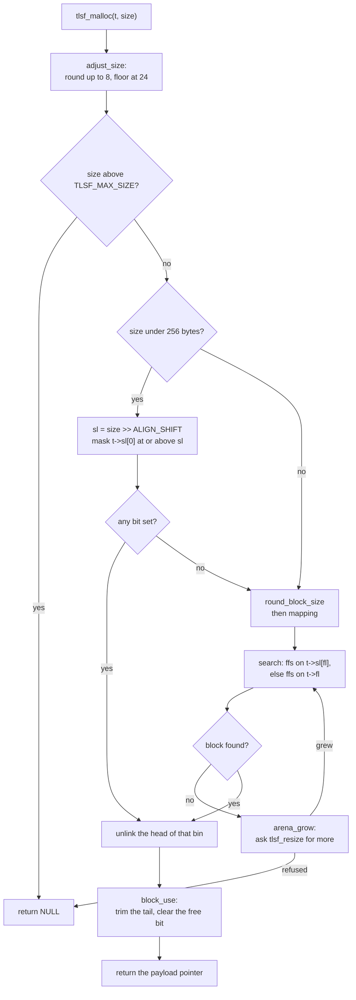
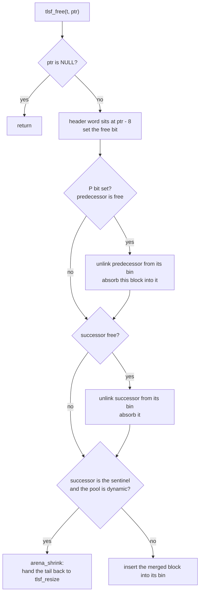
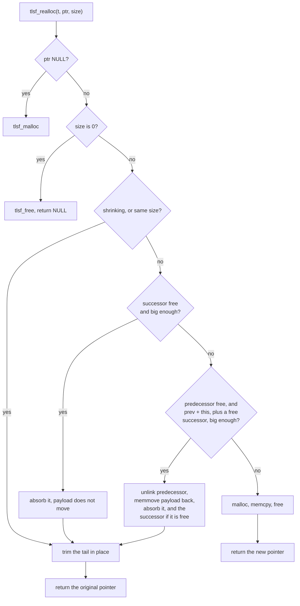
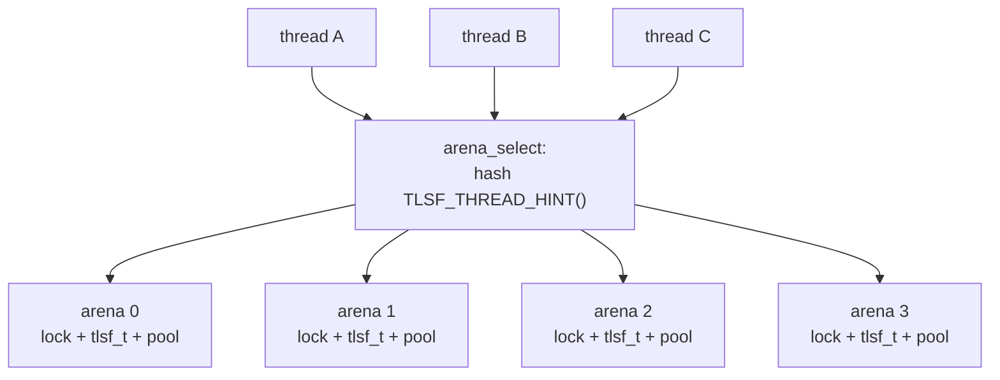
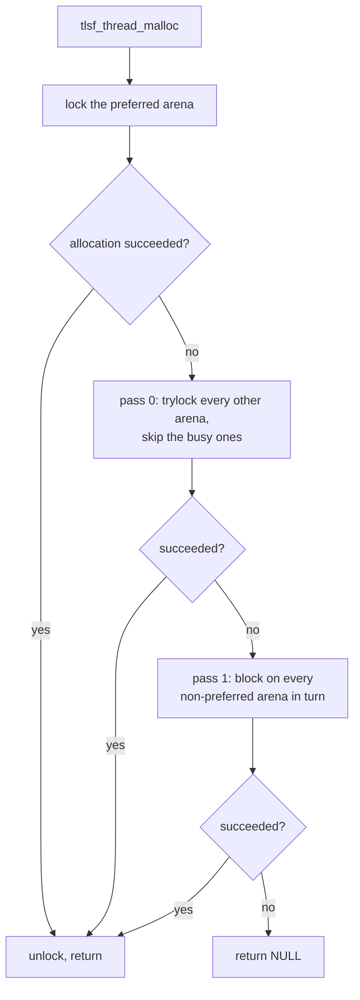

# Operations

What each entry point does with the index and the blocks that
[Design](design.md) describes. Every path below is constant-time unless the text
says otherwise; the exceptions are listed in [Complexity](#complexity). The last
section covers the optional thread-safe wrapper, which layers locking over
exactly these paths.

Sizes below are for a 64-bit build: 8-byte alignment, a 24-byte minimum block,
a 256-byte boundary between the linear and logarithmic size regimes, and a
header one word below the payload. On 32-bit each of those halves, to 4, 12,
128 and one 4-byte word.

## Allocation



Five details are worth calling out.

The small fast path skips `log2floor`, `round_block_size` and `mapping`
entirely. First-level class 0 is binned linearly at `ALIGN_SIZE` granularity, so
the bin index is a shift, and an adjusted request is already on a bin boundary.
It is a fast path only, not a separate policy: if class 0 has nothing at or
above the requested bin, control falls through to the generic search, which will
find a larger class.

The search takes the head of the first non-empty bin at or above the target. It
does not scan the list for a better fit, and it does not compare sizes. Rounding
the request up beforehand is what makes that safe.

The block found may be larger than the request, sometimes much larger, since a
whole first-level class may have been skipped. `block_use()` trims the tail if
the remainder reaches `BLOCK_OVERHEAD + TLSF_SPLIT_THRESHOLD`, so an oversized
block is not handed out whole; the remainder goes straight back into its bin.

The allocation keeps the size that was requested, not the size of the bin it
came from. Inflating it to the bin minimum would hand out the entire block on a
fresh pool: a 1 MB pool served two 1 KB requests instead of about a thousand
before that was fixed.

`arena_grow()` runs only for dynamic pools, and only when the search failed. It
asks `tlsf_resize()` for the rounded request plus the current arena size plus
one word for the sentinel that ends up at the new tail, or for the request plus
two words when there is no arena yet. It then merges the new span into the block
chain by turning the old sentinel into a free block, coalescing that with the
free block before it if there is one, and writing a fresh sentinel at the end.
It refuses if the total would exceed `2^FL_MAX`, which is what keeps a merged
block inside the mapping range. A fixed pool skips all of this and the
allocation simply fails.

## Deallocation



Coalescing is immediate and unconditional. There is no deferred pass, no
periodic compaction, and no free-list scavenging, which is what keeps the worst
case bounded: the most expensive free is a block with free neighbours on both
sides, and that is two unlinks, two header updates and one insert.

Backward coalescing is O(1) because of the `P` bit and the `prev` boundary tag.
Without them, finding the predecessor of a block would mean walking the chain
from the start of the pool, and free would be O(n).

`arena_shrink()` fires only when the freed block is the last one before the
sentinel and the pool is dynamic. It reduces `t->size`, calls `tlsf_resize()`,
and turns the block into the new sentinel. Either answer from the backend is
acceptable here: the same base means it accepted the smaller size, NULL means it
declined and left the mapping intact. The allocator has reduced `t->size` either
way, so a backend that keeps the bytes has them sitting idle until a later
`arena_grow()` asks for that span again.

## Reallocation

Three ways to grow, tried in order of cost:



Shrinking never relocates. The block is trimmed in place and the remainder is
returned to a bin, merged with the successor first if that is free.

The backward path always absorbs the predecessor, and absorbs the successor too
when that one is free. Its size test counts the successor's bytes on the same
condition, so a request that neither neighbour can satisfy alone but both can
together is handled there rather than by a separate case.

Its order of operations is forced from both ends: the predecessor must leave its
free list before the payload moves, because its list pointers sit in the bytes
about to be overwritten, and the move must happen before the absorb, because
absorbing writes the successor's `prev` field over the last word of the source
payload. The move uses `memmove`, not `memcpy`: source and destination overlap
whenever the predecessor is smaller than the payload being slid down.

Two paths are not constant-time, and for the same reason: the backward expansion
slides the payload down with `memmove`, and relocation `memcpy`s the whole old
block, which on that path is the smaller of the two. Both are linear in the
payload, not in the heap. Forward growth and shrinking move nothing. A failed
relocation returns NULL with the original block untouched, so the caller has not
lost the data.

## Aligned allocation

`tlsf_aalloc(t, align, size)` needs a payload pointer on an arbitrary power-of-2
boundary, which the ordinary path cannot promise beyond `ALIGN_SIZE`.

1. Over-allocate: `request + align - 1 + sizeof(tlsf_block)`.
2. Find the first aligned address at or after `payload + sizeof(tlsf_block)`.
3. `block_ltrim_free()` splits at the gap, puts the front piece back on a free
   list, and returns the second block, whose payload starts exactly there.
4. `block_use()` trims the tail down to the adjusted request.

```
    ┌──────┬──────────────────────────┬──────┬─────────────────────┐
    │ hdr  │ gap                      │ hdr  │ aligned payload     │
    └──────┴──────────────────────────┴──────┴─────────────────────┘
           ▲                                 ▲
           │                                 └──▸ the aligned address
           └──▸ payload of the block found
```

The gap becomes an ordinary free block, and the `sizeof(tlsf_block)` term in
step 1 is what guarantees it is big enough to be one rather than an
unaddressable sliver. When `align <= ALIGN_SIZE` the whole dance is skipped and
the call becomes `tlsf_malloc()`.

Freeing an aligned allocation is an ordinary `tlsf_free()`; nothing records that
the block came from `tlsf_aalloc()`, because nothing needs to.

## Pool modes

| | Fixed pool | Dynamic pool |
|---|---|---|
| Created by | `tlsf_pool_init()` | `TLSF_INIT` plus a first allocation |
| Memory owner | caller | `tlsf_resize()` backend |
| Grows on exhaustion | no, allocation fails | yes, via `tlsf_resize()` |
| Shrinks on free | no | yes, when the tail block becomes free |
| `tlsf_pool_reset()` | yes | no, returns without acting |
| `tlsf_append_pool()` | yes, adjacent memory only | yes, adjacent memory only |

`tlsf_resize()` is a weak symbol with a default that returns NULL, so fixed-pool
users need not define it at all. Dynamic-pool users must, and if they forget,
allocations fail silently rather than crashing. Its contract is in
`include/tlsf.h`: the base address is established by the first successful call
and must not move while the arena is live, a NULL return must leave the old
mapping intact, and a resize to zero ends the arena's lifetime.

`tlsf_append_pool()` is the one way to add memory to a pool without a resize
callback, and it only works if the new region starts exactly where the old one
ends. It returns the number of bytes it took, 0 if the region is not adjacent,
not usable, or too small.

`tlsf_pool_reset()` discards every allocation in a fixed pool and rebuilds the
single spanning free block. It is bounded, not O(n) in the number of live
allocations: the cost is clearing `FL_COUNT * SL_COUNT` bin heads plus writing
two headers. Nothing walks the blocks, so no destructor or bookkeeping the
caller layered on top will run.

## Complexity

| Operation | Cost | Note |
|-----------|------|------|
| `tlsf_malloc` | O(1) | two bitmap scans, one unlink, at most one split |
| `tlsf_free` | O(1) | at most two merges, one insert |
| `tlsf_realloc` | O(1) forward or shrink | backward growth and relocation each copy the payload once |
| `tlsf_aalloc` | O(1) | one extra split at the front |
| `tlsf_usable_size` | O(1) | one header read |
| `tlsf_append_pool` | O(1) | one merge, one sentinel write |
| `tlsf_pool_init` | O(FL_COUNT x SL_COUNT) | 1024 bin heads by default |
| `tlsf_pool_reset` | O(FL_COUNT x SL_COUNT) | same, independent of live blocks |
| `tlsf_get_stats` | O(blocks) | walks the physical chain |
| `tlsf_check` | O(blocks + free blocks + bins) | debug builds only; the bin sweep is unconditional, 1024 by default |

The O(1) claims are worst case, not amortized and not expected: no path contains
a loop whose trip count depends on the heap contents. The measured constants are
in [WCET measurement](configuration-and-verification.md#wcet-measurement).

## Concurrency

Everything above is single-threaded by design. `tlsf_t` has no lock, no atomic
field, and no memory barrier anywhere in `src/tlsf.c`: two threads calling
`tlsf_malloc()` on the same instance is a data race, full stop.

That is the right default for the target. On a bare-metal or RTOS system the
synchronization primitive is not a given, and a hardcoded mutex would be both
wrong and unavoidable. Callers who already hold a lock, or who give each thread
its own `tlsf_t`, should not pay for one either.

`include/tlsf_thread.h` is the optional wrapper for everyone else.

### Per-arena locking

The wrapper splits one memory region into `TLSF_ARENA_COUNT` independent
sub-pools, each a complete `tlsf_t` with its own lock. This is the multi-arena
pattern jemalloc and mimalloc use, at a much smaller scale.



Each arena is padded up to `TLSF_CACHELINE_SIZE` so two arenas never share a
cache line. Without that padding, threads on different cores would ping the same
line on every allocation and the split would buy nothing.

The thread-to-arena map is a hash, not a round robin:

```c
unsigned h = TLSF_THREAD_HINT();
h ^= h >> 16;
h *= 0x45d9f3bU;
h ^= h >> 16;
return h % count;
```

Thread identifiers often differ only in low bits, or only in high bits when they
are page-aligned stack addresses. Mixing before the modulo keeps both cases
spread across arenas.

### Allocation in two phases



The fast path is one uncontended lock, one allocation, one unlock. The fallback
exists because arenas partition memory: one can be exhausted while others have
room. Trying the non-blocking pass first means a thread whose own arena is full
prefers an idle arena over waiting on a busy one. The second pass retries every
non-preferred arena, including ones the first pass locked successfully but found
too full, since another thread may have freed into them meanwhile.

### Free and realloc

Free has no thread hint to work with; the pointer could come from any arena. The
wrapper finds the owner by range check over the arena bases, which is
O(TLSF_ARENA_COUNT) with a tiny constant, then locks only that arena. A pointer
outside every arena's range is ignored rather than passed down. That is a range
check, not a validity check: a pointer that falls inside an arena but was never
returned by this allocator is passed to `tlsf_free()` and is undefined behaviour
exactly as it would be on the core API.

Realloc tries in place inside the owning arena first, holding that arena's lock
for the attempt and reading `tlsf_usable_size()` under the same lock, since the
size is needed for a possible cross-arena copy afterwards. If the owning arena
cannot satisfy the new size, the wrapper allocates from any arena, copies, and
frees the original. The original is untouched until the copy succeeds, so a
failed realloc loses nothing.

### Lock backends

`TLSF_LOCK_T` and five macros abstract the primitive. The header picks a default
in this order:

| Condition | Backend |
|-----------|---------|
| `TLSF_LOCK_T` already defined by the caller | whatever the caller supplied |
| `TLSF_C11_THREADS` with C11 threads available | C11 `mtx_t` |
| Windows, `_WIN32_WINNT >= 0x0600` or a compiler new enough to imply it | `SRWLOCK` |
| Windows, older | `CRITICAL_SECTION` |
| POSIX: `__unix__`, `__APPLE__`, `__linux__` and friends | `pthread_mutex_t` |
| anything else | none, and the header will not compile |

There is no catch-all default. A target that is neither Windows nor POSIX, which
is the bare-metal and RTOS case this section is about, must supply
`TLSF_LOCK_T` itself; without it the arena structure has no lock member and the
build fails at the struct definition rather than at link time.

Keeping the Windows default at the native lock is what makes C and C++
translation units select the same backend; the ABI guard still rejects a
backend mismatch. It encodes which of the four the header landed on, not
whether C11 threads were asked for, so the pair no build system chooses between
is covered too: `_WIN32_WINNT` is settable per translation unit, and an
`SRWLOCK` build mixed with a `CRITICAL_SECTION` one puts `base` and `capacity`
at different offsets inside every arena and hands storage prepared by
`InitializeSRWLock` to `EnterCriticalSection`. Sizes are no guide here. The
cache-line alignment absorbs the 32-byte difference between those two locks, so
`sizeof(tlsf_thread_t)` comes out identical either way, and `mtx_t` and
`pthread_mutex_t` are the same size on glibc to begin with.

Windows builds that used to reach `mtx_t` without asking now get the native lock
instead. That is every C build with a usable `<threads.h>`, MinGW and clang but
also MSVC under `/std:c11`: MSVC never defines `__STDC_NO_THREADS__`, so the old
test could not tell a compiler that has C11 threads from one that does not.
Rebuilding everything is enough, and a partial rebuild fails to link rather than
silently disagreeing about the layout of `tlsf_thread_t`.

`TLSF_C11_THREADS` brings `mtx_t` back, in C++ as much as in C. Nothing forbids
a C++ unit from using the C11 header; the two languages simply establish that it
is there by different means. C reads `__STDC_VERSION__`, which C++ does not
define, so the C++ arm probes with `__has_include` instead. GCC and clang offer
that probe in every mode, not only C++17. Where it is missing, which in practice
means an older MSVC C++ mode, the arm falls back to the same 17.8 version test
the C side uses, so the two languages still agree.

`__STDC_NO_THREADS__` is checked once, before that split, and a compiler that
defines it gets taken at its word in either language. The name is misleading:
clang defines it in C++ mode, and defines it for its MSVC targets in both
languages, so clang-cl declines the C11 backend even where the toolset ships
`<threads.h>`. Consistency is worth more here than reach, since the alternative
is clang-cl selecting `mtx_t` from C and `SRWLOCK` from C++ off one flag.

One combination still splits them, a C library that sets `__STDC_NO_THREADS__`
while shipping the header anyway, read by a compiler that offers no such macro
to C++. C declines, C++ accepts. The ABI suffix makes that a link error as soon
as the C++ side calls a wrapper function, which is the useful half of the
answer. It is not a complete net: a C++ unit that only embeds `tlsf_thread_t` in
a structure, or takes its size, and leaves every call to C emits nothing for the
linker to catch, and the two layouts disagree in silence. On such a toolchain,
mixing the two languages means leaving the flag off.

Porting to an RTOS means defining `TLSF_LOCK_T`, the five lock macros, and
`TLSF_THREAD_HINT()` before including the header. The header's own example is
FreeRTOS:

```c
#define TLSF_LOCK_T           SemaphoreHandle_t
#define TLSF_LOCK_INIT(l)     ((*(l) = xSemaphoreCreateMutex()) ? 0 : -1)
#define TLSF_LOCK_DESTROY(l)  vSemaphoreDelete(*(l))
#define TLSF_LOCK_ACQUIRE(l)  xSemaphoreTake(*(l), portMAX_DELAY)
#define TLSF_LOCK_RELEASE(l)  xSemaphoreGive(*(l))
#define TLSF_LOCK_TRY(l)      (xSemaphoreTake(*(l), 0) == pdTRUE)
#define TLSF_THREAD_HINT()    ((unsigned) uxTaskGetTaskNumber(NULL))
```

A caller-supplied lock type bypasses the header's selection, which also bypasses
the [mismatch guard's](configuration-and-verification.md#configuration-mismatch-guard)
ability to detect a backend disagreement. Keeping the definition in one shared
header is then the caller's responsibility.

### Trade-offs

More arenas mean less contention and worse utilization: memory is partitioned up
front, so N arenas mean a single allocation can never exceed roughly 1/N of the
pool, no matter how idle the others are. Fewer arenas mean the opposite. Four is
the default because it covers the common small-core case without fragmenting a
modest pool into uselessly small pieces.

The wrapper also reduces the arena count on its own when the pool is too small
to give every arena at least 256 bytes, halving until it fits. A one-arena
`tlsf_thread_t` is a correct, if uninteresting, configuration.

Two more things the wrapper does not do. It does not migrate a thread between
arenas under contention, so a pathological hash collision stays collided. And it
does not thread-cache: every allocation takes a lock, unlike jemalloc's
`tcache`, which serves most allocations without one. Both are deliberate, since
both cost determinism, which is the property this allocator exists to provide.
